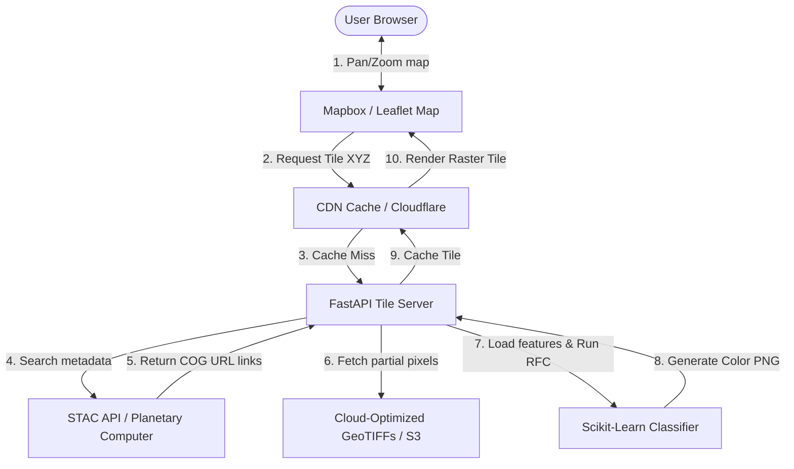

# Global Land-Cover Classification System using Sentinel-2

This guide outlines the architecture, data strategies, and implementation details for a serverless, boundary-free global land-cover classification system using Sentinel-2 imagery.

---

## 1. Technical Evaluation

### 1.1 Sufficiency of NDVI, NDWI, and NDBI Alone
While **NDVI** (Normalized Difference Vegetation Index), **NDWI** (Normalized Difference Water Index), and **NDBI** (Normalized Difference Built-Up Index) are strong indicators of vegetation, water, and built-up surfaces, they are **not sufficient alone** for a robust global classification system due to:
*   **Spectral Confusion**: Bare soil, dry crop fields, and concrete structures often have overlapping spectral responses in the SWIR (Shortwave Infrared) and NIR bands, confusing NDBI and NDVI.
*   **Seasonal Variability**: Deciduous forest, crop growth cycles, and snow cover alter index values drastically throughout the year. A single threshold is ineffective globally.
*   **Sub-Pixel Mixing**: Built-up areas are mixed with trees and grass, yielding hybrid index values.
*   **Resolution & Atmospherics**: Clouds and shadow skew index ratios unless cloud masking and atmospheric correction (L2A processing) are applied.

**Recommendation**: Combine these indices with raw bands (B2, B3, B4, B8, B11, B12), digital elevation models (DEM), and temporal statistics (mean/median over a season) to resolve spectral ambiguities.

---

### 1.2 Impact of Random Forest Classification
Yes, integrating a **Random Forest Classifier (RFC)** significantly improves classification accuracy compared to simple index thresholding:
*   **Non-Linear Boundaries**: Rather than selecting arbitrary cuts (e.g., $NDVI > 0.4$), RFC automatically determines multi-dimensional boundaries.
*   **Feature Importance Ranking**: RFC evaluates which bands or indices contribute most to correct classification, facilitating model optimization.
*   **Robustness to Outliers**: Being an ensemble method of decision trees, it is highly resilient to pixel-level noise, cloud shadows, and local anomalies.
*   **Multi-Class Adaptability**: Natively classifies multiple classes simultaneously (Vegetation, Water, Urban, Bare Soil) rather than relying on nested conditional heuristics.

---

## 2. System Architecture

The following diagram illustrates the cloud-native, on-the-fly classification workflow when a user interacts with the web map dashboard.

### Key Components:
1.  **Frontend**: Built with Leaflet.js or Mapbox GL JS. Requests standard XYZ raster tile layers dynamically.
2.  **API Gateway / Tile Server**: A serverless Python service (e.g., FastAPI running on AWS Lambda or Google Cloud Run) using `titiler` or custom handler.
3.  **STAC API**: Planetary Computer or AWS STAC to dynamically query the most recent cloud-free Sentinel-2 scenes inside the user's viewport bounding box.
4.  **Cloud-Optimized GeoTIFF (COG)**: Hosted on public cloud buckets (AWS S3, Azure Blob Storage). The Tile Server reads only the required pixel window using HTTP range requests.
5.  **ML Inference Engine**: Loads a pre-trained scikit-learn Random Forest model to classify pixels on the fly and output a colored PNG tile.

---

## 3. Implementation Strategies

### 3.1 Google Earth Engine (GEE) Integration
Integrating GEE handles heavy spatial computation serverlessly:
*   **Authentication**: Authenticate on the backend using a service account private key JSON file.
*   **Image Processing**: Fetch the `COPERNICUS/S2_SR_HARMONIZED` collection, mask clouds using `COPERNICUS/S2_CLOUD_PROBABILITY`, and calculate NDVI/NDWI/NDBI in the cloud.
*   **On-the-fly classification**: Train a GEE random forest classifier (`ee.Classifier.smileRandomForest`) and apply it over the map.
*   **Tile Delivery**: Request map tile URL templates from GEE (`ee.data.getTileUrl`) and serve them directly to your frontend map without passing imagery through your own servers.

### 3.2 Dynamic Processing on Pan and Zoom
To process Sentinel-2 tiles dynamically as the user moves:
1.  The frontend leaflet map fires `/tile/{z}/{x}/{y}` requests.
2.  The tile server translates `(z, x, y)` coordinates to a spatial bounding box (BBOX) in Mercator (`EPSG:3857`) and projects it to the source projection.
3.  The server fetches only the bounding box pixels using **windowed reading** with `rasterio` or `rioxarray` directly from the Sentinel-2 cloud storage URL.
4.  Classification runs on the retrieved 256x256 pixel grid, is styled, and returned to the client as an image byte stream.

### 3.3 Training with Global Datasets
*   **LandCoverNet / ESA WorldCover (10m)**: These datasets provide global, pixel-level classifications.
*   **Sampling Strategy**: Randomly sample coordinate points across various biomes and climate zones, query their corresponding historical Sentinel-2 bands, and construct a globally representative tabular dataset (`[B2, B3, B4, B8, B11, B12, NDVI, NDWI, NDBI] -> label`).
*   **Training**: Train the Random Forest offline using `scikit-learn` and export it (using `joblib`) to the tile server.

### 3.4 Scaling Globally Without Local Storage
*   **Do not download full tiles**: Leverage COGs to download only bytes corresponding to the user's viewport.
*   **Edge Caching**: Cache generated tiles at CDN endpoints (e.g., Cloudflare) to prevent redundant classification computation.
*   **Autoscaling**: Host the classification microservice on AWS Lambda, allowing it to scale from 0 to thousands of concurrent requests automatically.

---

## 4. Step-by-Step Implementation Steps

1.  **Extract training samples**: Use GEE or Planetary Computer to sample pixels globally from ESA WorldCover and their matching Sentinel-2 bands.
2.  **Train the model**: Build and fit a Random Forest model in Python, saving it as `landcover_model.pkl`.
3.  **Build the FastAPI Tile Server**: Write a python service that takes tile coordinates, queries the STAC API for the cloud-free image ID, performs windowed reads, classifies, and returns a PNG.
4.  **Create the Frontend Map**: Write a simple HTML/Leaflet map targeting the tile server endpoint.
5.  **Deploy**: Host the frontend on Vercel/Netlify and backend on Cloud Run or AWS Lambda behind Cloudflare.
